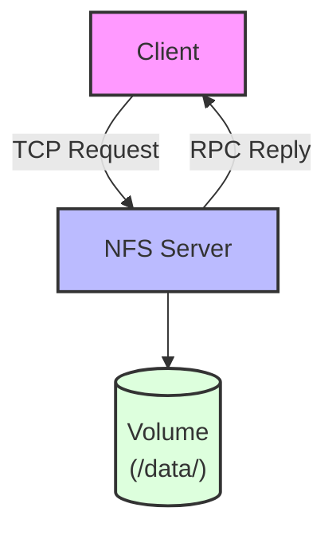

# Merge NFS avec PeerReview

[TOC]

---

## 1. Introduction

### 1.1 Contexte

Ce document décrit l'intégration de l'application NFS (Network File System). L'application NFS est la deuxième application du projet PeerReview, après l'application Gossip.

### 1.2 Objectifs de l'Intégration

- [x] Démontrer la versatilité de PeerReview sur un pattern client-serveur RPC
- [x] Garantir le déterminisme complet des opérations de fichiers
- [x] Fournir une traçabilité exhaustive pour replay et vérification
- [x] Permettre la détection de fautes dans des systèmes de stockage distribués

### 1.3 Différences avec Gossip

| Aspect | Gossip | NFS |
|:------:|:------:|:---:|
| **Pattern** | Broadcast épidémique | Client-Serveur RPC |
| **Communication** | Peer-to-peer | Request/Reply |
| **État** | Messages transitoires | Fichiers persistants |
| **Concurrence** | Diffusion multiple | Accès concurrent aux fichiers |
| **Consistance** | Eventual | Immédiate (avec verrous) |

---

## 2. Description de l'Application NFS

### 2.1 Vue d'Ensemble

L'application NFS est un système de fichiers réseau simplifié qui permet à des clients d'effectuer des opérations de lecture, écriture, suppression et listage de fichiers sur des serveurs distants.

### 2.2 Opérations Supportées

#### Commande READ
:::info
**Signature:** `Read { file_path: String, offset: u64, length: u64 }`

**Description:** Lit un nombre spécifié d'octets (length) à partir d'une position donnée (offset) dans le fichier spécifié par file_path.

**Résultat:** 
- ✅ Succès : `ReadOk { data: Vec<u8> }` (retourne les données lues)
- ❌ Échec : `Error`
:::

#### Commande WRITE
:::info
**Signature:** `Write { file_path: String, offset: u64, data: Vec<u8> }`

**Description:** Écrit les données (data) dans le fichier spécifié par file_path à partir de la position (offset). Le fichier est créé s'il n'existe pas.

**Résultat:**
- ✅ Succès : `WriteOk { bytes_written: u64 }`
- ❌ Échec : `Error`
:::

#### Commande DELETE
:::info
**Signature:** `Delete { file_path: String }`

**Description:** Permet la suppression du fichier dont le chemin est spécifié.

**Résultat:**
- ✅ Succès : `DeleteOk`
- ❌ Échec : `Error`
:::

#### Commande LIST
:::info
**Signature:** `List { dir_path: String }`

**Description:** Cette fonction permet de lister l'ensemble des éléments contenus dans le répertoire spécifié.

**Résultat:**
- ✅ Succès : `ListOk { entries: Vec<String> }`
- ❌ Échec : `Error`
:::

### 2.3 Architecture




#### Les Composants Clés

- **Clients:** Ce sont les entités qui initient et envoient les requêtes d'accès aux fichiers (requêtes NFS)
- **Serveurs:** Ils sont responsables de la réception et du traitement de ces requêtes. Leur rôle est d'effectuer les manipulations de fichiers demandées
- **Volumes:** Ils représentent la zone de stockage physique et sont conçus pour assurer une persistance et une isolation des données par serveur {Docker}

---

## 3. Architecture et Fonctionnalités

### 3.1 Stack Technique

- **Runtime Async:** Tokio
- **HTTP Framework:** Axum 0.7
- **Sérialisation:** Bincode (TCP) + Serde JSON (HTTP)
- **Infrastructure:** Docker + Docker Compose

### 3.2 Protocoles de Communication

Deux principaux protocoles de communication sont supportés pour interagir avec le service :

#### 1. Protocole TCP Binaire

- **Format:** Compact et performant `[4 bytes: longueur en big-endian][N bytes: message bincode]`
- **Connexion:** Persistante
- **Usage:** Idéal pour les clients NFS natifs nécessitant une haute performance

#### 2. API HTTP REST

- **Format:** JSON, facilitant le débogage
- **Fonctionnalités:**
  - `POST /read` : Lecture de fichier
  - `POST /write` : Écriture dans un fichier
  - `POST /delete` : Suppression de fichier
  - `POST /list` : Liste du contenu d'un répertoire
  - `GET /stats` : Affichage des statistiques du serveur
- **Intégration:** Utilisé pour les Healthchecks Docker {Pas pour l'envoi et réception des msg entre les nœuds}

### 3.3 Mécanisme de Verrouillage (Rust)

```rust
file_locks: Arc<DashMap<String, Arc<tokio::sync::Mutex<()>>>>
```

#### Principe de Fonctionnement

- **Stockage Concurrent:** Utilisation d'un `DashMap` (carte hachage concurrente) pour la gestion des verrous
- **Verrou Asynchrone:** Chaque fichier est protégé par un `tokio::sync::Mutex` asynchrone
- **Haute Granularité:** Un verrou spécifique est attribué à chaque fichier, permettant des opérations en parallèle sur des fichiers distincts
- **Sécurité RAII:** Le verrouillage suit le motif RAII (Resource Acquisition Is Initialization), garantissant sa libération automatique après usage

#### Garanties Offertes

- :white_check_mark: **Parallélisme:** Les opérations ciblant des fichiers différents s'exécutent simultanément
- :white_check_mark: **Sérialisation:** Les opérations sur un même fichier sont exécutées séquentiellement
- :white_check_mark: **Absence de Deadlock:** Le système est conçu pour prévenir les interblocages, car l'acquisition d'un seul verrou est nécessaire à la fois

---

## 4. Intégration et Compatibilité avec PeerReview

### 4.1 Principes Fondamentaux de PeerReview

Le mécanisme PeerReview repose sur quatre exigences principales :

1. **Déterminisme:** Assurer qu'une même séquence d'entrées produise systématiquement la même sortie
2. **Traçabilité:** Maintenir un historique complet et détaillé de toutes les opérations effectuées
3. **Vérifiabilité:** Rendre possible une relecture (replay) exacte et fidèle de l'exécution
4. **Détection des Fautes:** Identifier toute divergence de comportement comme une faute système

### 4.2 Adaptation de NFS aux Exigences de PeerReview

L'implémentation NFS assure sa compatibilité avec PeerReview grâce aux mécanismes suivants :

| Exigence PeerReview | Mécanisme d'Implémentation NFS |
|:-------------------|:-------------------------------|
| Horloge déterministe | Utilisation de l'objet `DeterministicClock` (basé sur l'horloge logique de Lamport) |
| Ordre des opérations | Gestion par Verrous et utilisation de Timestamps |
| Historique des actions | Stockage des 100 dernières opérations via un `VecDeque<String>` |
| RPC traçable | Assignation d'un UUID v4 unique à chaque requête |
| Absence d'aléatoire | Éviter l'usage de sources non déterministes comme `SystemTime::now()` |
| Replay exact | Garantie que des timestamps identiques entraînent le même ordre d'exécution |

### 4.3 L'Horloge Logique de Lamport : DeterministicClock

Le cœur de la gestion déterministe du temps est la structure `DeterministicClock` :

```rust
pub struct DeterministicClock {
    current_time: AtomicU64,
}

impl DeterministicClock {
    pub fn update_time(&self, time: u64) {
        self.current_time.fetch_max(time, Ordering::SeqCst);
    }
}
```

#### Protocole d'Usage :

1. Le client initie une requête en y incluant son propre `timestamp=T`
2. Le serveur met à jour son horloge en exécutant `clock.update_time(T)`, ajustant ainsi son temps à $max(horloge\ actuelle, T)$
3. Le serveur procède à l'exécution de l'opération demandée
4. Le serveur répond au client en incluant le nouveau `timestamp=clock.now()`

:::success
**Garantie:** Ce protocole assure le maintien de l'ordre causal (la relation de type *happened-before*)
:::

---

## 5. Points d'Injection PeerReview

### 5.1 Couche de Vérification

Pour intégrer PeerReview, il faut ajouter :

#### Logging Déterministe

**Emplacement:** `apps/nfs_node/src/main.rs`

```rust
// Actuellement (ligne 260-286)
fn log_operation(&self, operation: &NFSOperation, response: &NFSResponse) {
    let log_entry = format!("{} -> {}", op_str, result_str);
    self.operation_history.lock().push_back(log_entry);
}

// Avec PeerReview
fn log_operation(&self, operation: &NFSOperation, response: &NFSResponse) {
    let log_entry = format!("{} -> {}", op_str, result_str);
    
    // Log local (existant)
    self.operation_history.lock().push_back(log_entry.clone());
    
    // NOUVEAU: Log PeerReview
    peerreview::log_event(PeerReviewEvent {
        timestamp: self.clock.now(),
        node_id: self.my_id.clone(),
        event_type: EventType::NfsOperation,
        payload: bincode::serialize(&(operation, response)).unwrap(),
    });
}
```

#### Checkpoints d'État

**Fréquence:** Toutes les N opérations (ex: N=100)

```rust
async fn execute_operation(&self, operation: &NFSOperation) -> NFSResponse {
    let response = match operation {
        NFSOperation::Read { .. } => self.do_read(...).await,
        // ...
    };
    
    self.log_operation(operation, &response);
    
    // NOUVEAU: Checkpoint périodique
    let ops_count = self.operations_count.fetch_add(1, Ordering::Relaxed);
    if ops_count % 100 == 0 {
        self.create_checkpoint().await;
    }
    
    response
}

async fn create_checkpoint(&self) {
    let checkpoint = NFSCheckpoint {
        timestamp: self.clock.now(),
        volume_snapshot: self.snapshot_volume().await,
        operations_count: self.operations_count.load(Ordering::Relaxed),
        file_locks_state: self.file_locks.len(),
    };
    peerreview::save_checkpoint(checkpoint);
}
```

#### Replay Mechanism

**Fonction:** Rejouer les opérations depuis un checkpoint

```rust
async fn replay_from_checkpoint(
    checkpoint: NFSCheckpoint, 
    log: Vec<PeerReviewEvent>
) {
    // 1. Restaurer l'état depuis le checkpoint
    restore_volume_snapshot(checkpoint.volume_snapshot);
    
    // 2. Rejouer les opérations après le checkpoint
    for event in log {
        if event.timestamp > checkpoint.timestamp {
            let (operation, _) = bincode::deserialize(&event.payload).unwrap();
            let response = execute_operation(&operation).await;
            
            // Vérifier que la réponse est identique
            verify_determinism(event, response);
        }
    }
}
```

### 5.2 Authentification des Messages

#### Signatures Cryptographiques

Ajout aux messages RPC :

```rust
pub struct NFSRequest {
    pub rpc_id: String,
    pub from: NodeId,
    pub operation: NFSOperation,
    pub timestamp: u64,
    
    // NOUVEAU: PeerReview
    pub signature: Option<Vec<u8>>,      // Signature du message
    pub authenticator: Option<Vec<u8>>,  // Authenticator PeerReview
}

pub struct NFSReply {
    pub rpc_id: String,
    pub from: NodeId,
    pub response: NFSResponse,
    pub timestamp: u64,
    
    // NOUVEAU: PeerReview
    pub signature: Option<Vec<u8>>,
    pub authenticator: Option<Vec<u8>>,
}
```

#### Vérification des Signatures

```rust
async fn handle_tcp_connection(mut stream: TcpStream, state: ServerState) {
    loop {
        let request: NFSRequest = receive_and_deserialize(&mut stream).await?;
        
        // NOUVEAU: Vérifier signature PeerReview
        if let Some(sig) = request.signature {
            if !peerreview::verify_signature(&request.from, &request, &sig) {
                eprintln!("Invalid signature from {}", request.from);
                continue; // Ignorer requête non authentifiée
            }
        }
        
        // Traitement normal
        state.clock.update_time(request.timestamp);
        let response = state.execute_operation(&request.operation).await;
        // ...
    }
}
```

### 5.3 Détection de Divergence

#### Witnesses

Les témoins PeerReview vérifient que les réplicas produisent les mêmes résultats :

```rust
pub struct NFSWitness {
    server_logs: HashMap<NodeId, Vec<PeerReviewEvent>>,
}

impl NFSWitness {
    pub fn verify_consistency(&self, operation: &NFSOperation) -> bool {
        let responses: Vec<_> = self.server_logs
            .values()
            .filter_map(|log| self.find_response(log, operation))
            .collect();

        // Tous les serveurs doivent retourner la même réponse
        if responses.is_empty() {
            return false;
        }

        let first = &responses[0];
        responses.iter().all(|r| r == first)
    }
}
```

#### Challenge-Response

Si divergence détectée, le witness peut demander un replay :

```rust
pub fn challenge_node(&self, node_id: &NodeId, from_timestamp: u64) {
    let challenge = PeerReviewChallenge {
        target: node_id.clone(),
        from_timestamp,
        operations: self.get_operations_since(from_timestamp),
    };

    send_challenge(node_id, challenge);
}

pub async fn respond_to_challenge(&self, challenge: PeerReviewChallenge) {
    // Rejouer depuis le timestamp demandé
    let checkpoint = self.get_checkpoint_before(challenge.from_timestamp);
    let replay_result = replay_from_checkpoint(
        checkpoint, 
        challenge.operations
    ).await;

    send_challenge_response(challenge.target, replay_result);
}
```

---

## 6. Déterminisme et Traçabilité Renforcés

### 6.1 Garantie de Déterminisme

Pour assurer un comportement prédictible et reproductible du système, les sources traditionnelles de non-déterminisme ont été neutralisées, et des garanties spécifiques ont été mises en place :

#### ❌ Sources de Non-Déterminisme Écartées

- **Horloge Système:** Remplacée par une horloge déterministe (`DeterministicClock`)
- **Ordre d'Exécution Imprévisible:** La sérialisation est assurée par l'usage combiné de verrous et de timestamps
- **Aléatoire (Randomness):** L'utilisation de générateurs de nombres aléatoires non seedés est proscrite (sauf pour les UUIDs générés côté client)
- **I/O Asynchrone:** L'ordre des opérations asynchrones est strictement contrôlé par une horloge logique

#### ✅ Engagements de Déterminisme

- :white_check_mark: **Cohérence Temporelle:** Des timestamps identiques entraînent un ordre d'exécution identique
- :white_check_mark: **Verrous Contrôlés:** L'acquisition des verrous est basée sur les timestamps, garantissant leur déterminisme
- :white_check_mark: **Absence de Race Conditions:** L'utilisation de structures (`DashMap` et `Mutex` asynchrones) prévient les conditions de concurrence
- :white_check_mark: **Rejeu Exact (Replay):** L'intégralité de l'historique des opérations est conservée, permettant un rejeu exact du système

### 6.2 Outils de Traçabilité Complète

Le système intègre des mécanismes robustes pour un suivi et un débogage efficaces.

#### 6.2.1 Historique et Journalisation des Opérations

Un journal des 100 dernières opérations (utilisant un tampon circulaire) est maintenu. Chaque entrée est formatée pour une lecture claire :

| Type d'Opération | Exemple de Format | Statut |
|:----------------|:------------------|:-------|
| Écriture (WRITE) | `WRITE test.txt -> OK (42 bytes)` | Succès avec détails |
| Lecture (READ) | `READ config.yaml -> ERROR: No such file` | Échec avec motif |
| Suppression (DELETE) | `DELETE old.log -> OK` | Succès |
| Liste (LIST) | `LIST /data -> OK (15 entries)` | Succès avec nombre d'éléments |

#### 6.2.2 Statistiques du Serveur

L'état du serveur peut être interrogé via un point d'accès HTTP spécifique (`GET http://localhost:8091/stats`).

La structure des statistiques est la suivante :

```rust
pub struct NFSServerStats {
    pub node_id: NodeId,
    pub operations_count: usize,      // Compteur total
    pub last_operations: Vec<String>, // 10 dernières
    pub volume_size: u64,             // Taille du volume
    pub file_count: usize,            // Nombre de fichiers
}
```

#### 6.2.3 Identifiant RPC Unique (rpc_id)

Chaque requête distante (RPC) est dotée d'un `rpc_id` (UUID v4) unique pour :

- Assurer la corrélation sans ambiguïté entre la requête et sa réponse
- Faciliter la traçabilité de bout en bout (end-to-end)
- Simplifier les diagnostics et le débogage

---

## 7. Plan de Merge

### 7.1 Étape 1: Intégration de Base (Sans PeerReview)

**Objectif:** Faire fonctionner NFS de manière autonome

#### ✅ Déjà fait

- [x] Application NFS complète (`apps/nfs_node/`)
- [x] Protocoles communs (`crates/common_proto/src/nfs.rs`)
- [x] Infrastructure Docker
- [x] Tests manuels avec curl

### 7.2 Étape 2: Ajout de la Couche PeerReview

#### Tâches

##### 7.2.1 Ajouter Module PeerReview

**Nouveau fichier:** `apps/nfs_node/src/peerreview.rs`

```rust
pub mod peerreview {
    use crate::*;

    pub struct PeerReviewEvent {
        pub timestamp: u64,
        pub node_id: NodeId,
        pub event_type: EventType,
        pub payload: Vec<u8>,
    }

    pub enum EventType {
        NfsOperation,
        Checkpoint,
        StateChange,
    }

    pub fn log_event(event: PeerReviewEvent) {
        // Écrire dans le log PeerReview
        // Format: [timestamp][node_id][type][payload_hash]
    }

    pub fn verify_signature(
        from: &NodeId, 
        request: &NFSRequest, 
        sig: &[u8]
    ) -> bool {
        // Vérifier signature cryptographique
        // Utiliser clé publique du nœud from
    }

    pub fn save_checkpoint(checkpoint: NFSCheckpoint) {
        // Sauvegarder snapshot du volume + état
    }
}
```

##### 7.2.2 Modifier Structures de Messages

**Fichier:** `crates/common_proto/src/nfs.rs`

```rust
#[derive(Debug, Clone, Serialize, Deserialize)]
pub struct NFSRequest {
    pub rpc_id: String,
    pub from: NodeId,
    pub operation: NFSOperation,
    pub timestamp: u64,

    // NOUVEAU
    #[cfg(feature = "peerreview")]
    pub signature: Option<Vec<u8>>,
    #[cfg(feature = "peerreview")]
    pub authenticator: Option<Vec<u8>>,
}
```

##### 7.2.3 Instrumenter le Code

**Fichier:** `apps/nfs_node/src/main.rs`

Ajouter logs PeerReview aux points critiques :

- Début de `handle_tcp_connection`
- Après `execute_operation`
- Création de checkpoints périodiques

### 7.3 Étape 3: Tests d'Intégration

#### 7.3.1 Test de Replay

**Scénario:**

1. Exécuter 100 opérations NFS
2. Sauvegarder le log PeerReview
3. Arrêter le serveur
4. Restaurer depuis checkpoint
5. Rejouer les opérations
6. **Vérifier:** même résultats finaux

#### 7.3.2 Test de Détection de Faute

**Scénario:**

1. Lancer 2 réplicas NFS
2. Injecter une faute dans replica 2 (modifier un fichier manuellement)
3. Exécuter des opérations READ
4. Witness détecte divergence
5. Challenge le nœud fautif
6. **Vérifier:** faute détectée et rapportée

#### 7.3.3 Test de Concurrence Déterministe

**Scénario:**

1. Lancer 100 writes concurrents avec timestamps précis
2. Rejouer les mêmes 100 writes
3. **Vérifier:** ordre d'exécution identique
4. **Vérifier:** contenu des fichiers identique


